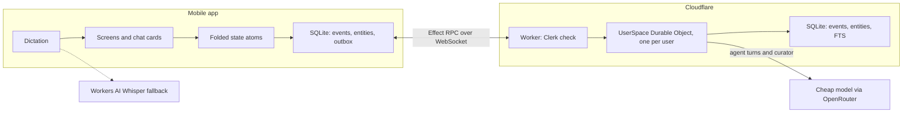
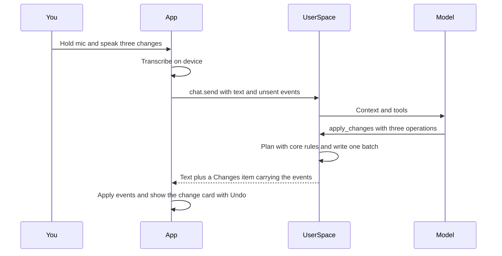

# Spin-off: a chat-first task app for mobile

This app is spun off from the t3-tasks fork of T3 Code (`danalexilewis/t3-tasks`, checked out at `~/repos/t3-tasks`). Paths written as `t3-tasks/...` are relative to that repo.

## Outcome

A new repo with three parts: an iOS-first Expo app, a Cloudflare backend and a shared `core` package.

- **Tasks by touch.** Gestures in the style of 30/30 and a TickTick-style Eisenhower matrix.
- **Tasks by voice or chat.** A cheap agent answers questions about your tasks and their history, and applies several changes from one dictated sentence.
- **Curated knowledge.** The agent keeps a Brief and a Handbook for each project.
- **Live cards in chat.** Replies embed cards that open the dedicated task, page and list screens.

Principles:

- **Good without the agent.** Task management has to be great by hand. The agent speeds things up; it does not replace the UI.
- **Every change is an event.** Each event records who made it (the actor) and why (the reason). Reasons are optional for you and required for the agent. History, Undo and "why did this move?" all come from those events.
- **Apply first, undo later.** The agent applies changes immediately. Each agent turn is one batch you can undo, so there are no confirm dialogs.
- **Cards stay live.** Cards in chat reference tasks and pages instead of copying them, so they always show the current state.
- **Curated context.** The agent sees a Brief, your open tasks and pinned pages, not an ever-growing transcript.

## Decisions

- **Audience.** You plus a handful of testers. Sign-in is through Clerk, with Sign in with Apple or an email code, and is invitation-only.
- **Local-first.** The phone keeps an append-only event log in `expo-sqlite`, and task management works offline. Chat needs a connection.
- **Backend.** One Cloudflare Worker plus one Durable Object per user, called `UserSpace`. It is built with Effect and alchemy, following the shape of `t3-tasks/infra/relay/src/worker.ts`. `UserSpace` owns that user's log, runs the agent and schedules curation.
- **Transport.** Effect RPC over a hibernating WebSocket, using alchemy's `RpcDurableObject`. This is the same RPC style as `t3-tasks/apps/server/src/ws.ts`. The Worker checks the Clerk token when the socket opens, then forwards the socket to `UserSpace` for that user id.
- **Model.** A cheap, fast model through OpenRouter, called with `effect/ai` toolkits like T3's MCP tools. The model name is a config value.
- **t3-tasks interop comes later.** Task fields stay identical to the fork's, so a bridge is a field mapping, not a migration.

## Architecture



A dictated turn that changes several things:



## Data model in `packages/core`

- **Ids.** Entity ids are short: a prefix (`t_`, `p_`, `pg_` or `c_`) plus 8 base32 characters, so a cheap model copies them reliably. Event ids are ULIDs.
- **Events.** Every event shares one envelope (shown in the snippet below), and there are four families:
  - `project.created` and `project.updated` (title, color, archived).
  - `task.created` and `task.updated`. These use the t3-tasks fields (`title`, `notes`, `status`, `quadrant`, `position`, `deleted`) plus a nullable `projectId`, which also moves a task between projects.
  - `page.created` and `page.updated` (title, body, pinned, deleted). A page's `kind` is `brief` or `page`. Each project has one brief. One more brief, with `projectId: null`, is the "Me" brief: what matters to you across everything.
  - `chat.created`, `chat.message` (the final parts of each message) and `chat.updated` (title and summary). Chats are events too, so they sync and work offline like everything else.
- **Storage.** The phone and the Durable Object keep the same two tables, written in one transaction:
  - `events` is append-only and carries an entity id.
  - `entities` holds the folded state, so startup never refolds the whole log.
  - The phone's outbox is simply its events that have no `seq` yet.
- **Fold.** Lifted from `foldProjectTaskEvents` in `t3-tasks/apps/server/src/projectTasks/ProjectTaskLog.ts`:
  - It sorts events by `(at, id)` and drops duplicate ids.
  - The last write wins, field by field.
  - It skips invalid lines and counts them.
  - Folding is per entity, so an event that arrives late refolds only its own entity.
- **Clock.** Each device stamps `at = max(now, lastSeenAt + 1ms)`, counting events it has received, so an edit always sorts after everything that device has seen. The server refuses events stamped more than a day ahead, and the app asks you to fix the device clock.
- **Rules.** `t3-tasks/apps/server/src/projectTasks/ProjectTaskRules.ts` moves over with the same behaviour:
  - New tasks go to the bottom of the Inbox.
  - Start moves a task to the top.
  - Triage places a task after the last To do in its quadrant.
  - Explicit placement wins over all of these.
  - Updates that change nothing write nothing.
  - Agents must give a reason.
- **Undo.** New in core: `planUndo(batch)`.
  - It reverts only fields that still hold the batch's values.
  - It reports anything you changed since, rather than overwriting it.
  - Its events carry `undoes`, so the card can show "Undone".
- **Caps.** Titles are capped at 200 characters, notes at 2,000, reasons at 280 and page bodies at 20,000.

```ts
const Envelope = {
  v: Schema.Literal(1),
  id: EventId,
  at: IsoDateTime,
  by: Schema.Union([
    Schema.Struct({ kind: Schema.Literal("user"), deviceId: DeviceId }),
    Schema.Struct({
      kind: Schema.Literal("agent"),
      chatId: ChatId,
      model: Schema.String,
    }),
  ]),
  reason: Schema.optional(Reason),
  batch: Schema.optional(BatchId),
  undoes: Schema.optional(BatchId),
};

const SyncSubscribeRpc = Rpc.make("sync.subscribe", {
  payload: Schema.Struct({ after: Seq }),
  success: SyncBatch,
  error: SpaceError,
  stream: true,
});
const ChatSendRpc = Rpc.make("chat.send", {
  payload: ChatSendInput, // chatId?, projectId, text, events (the phone's unsent events)
  success: ChatStreamItem, // Started | TextDelta | ToolStarted | Changes | Done
  error: SpaceError, // includes BudgetExceeded
  stream: true,
});
// Also: sync.push, chat.stop, chat.wrapUp, transcribe, usage.get, account.delete
```

## Sync

- **`sync.push`** appends events, ignores ids it already has and assigns a `seq` that increases per user.
- **`sync.subscribe({ after })`** streams the events the phone has missed, then new ones as they arrive. The phone keeps a cursor.
- **The agent's events** reach the phone twice. The phone drops the duplicates by id.
  - Immediately, as `Changes` items in the chat stream.
  - Durably, through `sync.subscribe`.
- **`chat.send`** includes the phone's unsent events, so the agent always sees what you just did.
- **Sign-out and account deletion.**
  - Signing out wipes the phone's database.
  - Delete account clears the Durable Object and the Clerk user. App Store rules require this for any app where users can create an account.

## Agent

- **Where turns run.** Turns run inside `UserSpace`, detached from the request that started them. The chat stream only follows the turn, so backgrounding the app never loses a reply; the final message arrives through sync. `chat.stop` cancels a turn.
- **Tools.** Five tools, typed with Schema through `Tool.make`, modelled on `t3-tasks/apps/server/src/mcp/toolkits/projectTask/tools.ts`:
  - `list_tasks` filters by project, status, quadrant and date, in priority order.
  - `search` uses full-text search (SQLite FTS5) over tasks, including completed ones and their reasons, plus pages and chat summaries.
  - `read` returns a task with its history, a page, or a chat summary.
  - `apply_changes` takes one batch of project and task operations: create, update, move, start, complete, delete, restore, and undo of an earlier batch. Core rules validate every operation before any is written, and the batch carries one reason.
  - `write_page` creates or replaces a page or a brief, with a reason.
- **Context.** `buildContext` is a pure function in core, and the phone shows its exact output on the Context tab.
  - Global chat gets:
    - today's date;
    - the Me brief;
    - every project with the first line of its brief;
    - the top 30 open tasks;
    - the Doing summary.
  - Project chat gets:
    - that project's brief;
    - its open tasks, up to 60, one compact line each;
    - a page index with a title and one line per page, with pinned pages included in full;
    - the summaries of the last three chats.
  - The conversation part is a rolling summary plus the last 12 messages. A token budget trims tasks and the page index first.
- **Curator.**
  - **Trigger:** tapping Wrap up in a chat, or an alarm after 30 idle minutes.
  - **Work:** one cheap call that updates the chat's title and summary, the brief and the handbook pages.
  - **Result:** it posts a "Handbook updated" card with Undo.
- **Budget.** Each turn's usage is recorded. A daily cap per user returns a typed error, and the chat says plainly that the cap was reached.

## Cards in chat

- **Change cards appear after every write.**
  - `apply_changes` renders a summary such as "Added 2, completed 1, moved 1", with one row per change and an Undo button.
  - `write_page` renders a page card showing the reason, also with Undo.
- **The model chooses which references to unfurl.** It writes links such as `[label](task:t_x)`, `page:` or `chat:`.
  - An inline reference becomes a chip.
  - A reference on its own line becomes a card, Open Graph style.
  - Consecutive task references become one live list whose status circles you can tap.
  - Unknown ids render as plain text, which guards against made-up ids.
- **Cards read live local state.** An old message shows a task's current status. Tapping a card opens `/task/[id]`, `/page/[id]` or `/chat/[id]`.

## Mobile app

- **Stack.** These match T3 mobile (`t3-tasks/apps/mobile/package.json`), except Expo Router, which is new here and gives cards their deep links:
  - Expo with Expo Router;
  - uniwind, following the system's light or dark mode;
  - Reanimated and Gesture Handler;
  - `@legendapp/list` for chat;
  - `expo-sqlite`, `expo-haptics` and `@clerk/expo`;
  - Effect with `@effect/atom-react`.
- **Now tab.** The global priority list.
  - Doing is pinned at the top with a chip such as "3 doing across 2 projects". The chip opens a sheet grouped by project, which stands in for the kanban board on mobile.
  - Swipe right to complete.
  - Swipe left for Top, Bottom, Quadrant, Project and Delete.
  - Long-press and drag to reorder.
  - Pull down to add a task to the Inbox.
  - Tap a row to open the task sheet.
  - Tasks done today fold away.
- **Triage tab.** The 2×2 matrix shows counts and top tasks, with an Inbox tray.
  - Triage Inbox shows one card at a time. Swipe up for Do, right for Schedule, left for Delegate and down for Eliminate.
  - Long-press any task to move it.
- **Chat tab.** A global chat by default, or one scoped to a project.
  - Hold the mic to dictate. The transcript lands in the composer, where you can edit it or send it.
  - Previous chats are in the header.
- **Projects tab.** Each project has four sections: Tasks, Chats, Handbook and Context. Context shows the editable brief, the pinned pages and a token meter for exactly what the agent sees.
- **Capture sheet.** The mic on the Now tab opens a compact view of the global chat. "Add X, move Y to the top, finish Z" shows its change card without leaving the list.
- **Task sheet.** Title, notes, status, quadrant, project and a history with reasons. Discuss opens a chat about the task.
- **Page screen.**
  - **Shows:** the page as markdown, with its history and a way to restore any earlier version.
  - **Ask about this:** opens a chat about the page.
  - **Editing:** the agent curates pages; only briefs are directly editable.
- **Settings.** Account, today's usage, dictation auto-send, JSONL export through the share sheet, Delete account and Sign out.
- **Dictation.**
  - **iOS 26 or later:** lift T3's on-device transcription from `t3-tasks/apps/mobile/src/native/voiceTranscription.ios.ts`, `t3-tasks/packages/client-runtime/src/voice-input/` and `t3-tasks/apps/mobile/src/features/voice-input/`.
  - **Android and older iOS:** send the audio to a `transcribe` RPC backed by Workers AI Whisper.

## Repo layout and what to lift

```text
<new-repo>/
  apps/mobile/     Expo app (Expo Router)
  apps/worker/     Worker, UserSpace Durable Object, alchemy stack (dev and testers stages)
  packages/core/   schemas, events, fold, clock, rules, order keys, selectors,
                   buildContext, refs, RPC group, tool definitions
  docs/            product.md, internals/sync.md, internals/agent.md
  AGENTS.md
```

Tooling mirrors t3-tasks:

- pnpm workspaces, `vp` and vitest;
- the same Effect version as the catalog in `t3-tasks/pnpm-workspace.yaml`, so lifted code compiles unchanged;
- `.repos/` holding effect-smol and alchemy-effect as read-only references.

Files to lift from t3-tasks:

- `t3-tasks/packages/shared/src/orderKey.ts` and its tests.
- `t3-tasks/apps/server/src/projectTasks/ProjectTaskRules.ts` and its tests. Change `projectKey` to `projectId`, and turn the thrown error classes into tagged results.
- The fold from `t3-tasks/apps/server/src/projectTasks/ProjectTaskLog.ts`, without `node:fs` or `node:crypto`.
- The field schemas and caps from `t3-tasks/packages/contracts/src/projectTasks.ts`.
- For the Worker:
  - Clerk verification from `t3-tasks/infra/relay/src/http/Api.ts`;
  - Durable Object SQLite from `t3-tasks/infra/relay/src/hooks/HookInboxObject.ts`;
  - the stack from `t3-tasks/infra/relay/alchemy.run.ts`.
- For the app:
  - the RPC client from `t3-tasks/packages/client-runtime/src/rpc/protocol.ts`;
  - the Clerk provider from `t3-tasks/apps/mobile/src/features/cloud/CloudAuthProvider.tsx`;
  - the SQLite setup from `t3-tasks/apps/mobile/src/persistence/mobile-database.ts`.

## Milestones

Each milestone ends with a TestFlight build. Testers outside your App Store Connect team need a Beta App Review and a demo login. Android testers get EAS internal builds.

1. **M0, foundations.**
   - Scaffold the repo, with `AGENTS.md` and `docs/product.md`.
   - Lift core with its tests passing.
   - Deploy the Worker and `UserSpace` with a Clerk-checked socket and a `ping` RPC.
   - Build an Expo shell with sign-in and tabs that calls `ping`.
   - Prove these early:
     - Effect RPC from React Native to a Durable Object socket;
     - FTS5 inside Durable Object SQLite;
     - `effect/ai` streaming tool calls through OpenRouter inside a Durable Object;
     - a detached turn surviving the socket closing.
2. **M1, tasks without the agent.**
   - The local event log, entities and atoms.
   - The Now and Triage tabs.
   - Projects, the task sheet, quick add and JSONL export.
   - Pick a drag-and-drop library for reordering by testing two candidates: `react-native-reorderable-list` and `react-native-sortables`.
   - This milestone runs offline on one device.
3. **M2, sync.**
   - Push, subscribe, entities in the Durable Object, the clock rules and outbox retry.
   - Sign-out wipe and Delete account.
   - Write `docs/internals/sync.md`. It records what must never change: lines are never rewritten, and `v` is bumped only together with a reader for the old version.
   - Done when two devices converge on the same state.
4. **M3, agent chat.**
   - The chat stream with detached turns, the five tools and `buildContext`.
   - Change cards with Undo, reference unfurls and the chat list.
   - The capture sheet, dictation with the Whisper fallback, and a "Dictate" home-screen quick action.
   - The usage cap.
   - Write `docs/internals/agent.md`.
5. **M4, handbook and context.**
   - Pages and briefs.
   - The Handbook section and the page screen with restore.
   - The Context tab.
   - The curator.

## Verification

- **Core.**
  - The fold converges across shuffled event orders.
  - The clock never goes backwards.
  - The ported rule tests pass.
  - `planUndo` reverts only untouched fields.
  - `buildContext` trims to the token budget.
  - References parse correctly.
- **Worker.**
  - Test the event store against in-memory SQLite: duplicate pushes, cursors, the clock check and entities.
  - Test the tools against a scripted `LanguageModel` layer, and check the events and cards they produce.
  - Never wait on sleeps.
- **Mobile.** Unit tests for selectors and the outbox, plus one scripted TestFlight pass per milestone, on iPhone and on Android.

## Hit every surface

- **Entry points.**
  - From Now: the mic and pull-down.
  - The Chat tab.
  - Discuss on a task.
  - Ask about this on a page.
  - The home-screen quick action.
- **Reverse states.** Each way in has a way out:
  - Done and Reopen.
  - Start and Stop.
  - Triage and Back to Inbox.
  - Delete and Restore.
  - An agent batch and Undo.
  - A page edit and Restore version.
  - Pin and Unpin.
  - Archive and Unarchive a project.
  - Sign in and Sign out.
  - Sign up and Delete account.
- **Connection modes.**
  - Offline, tasks still work and chat explains why it can't send.
  - Reconnecting resumes from the cursor.
  - Two devices converge.
  - Backgrounding the app mid-reply keeps the reply.
- **Agents.** The in-app agent goes through the same core rules as your taps. T3 Code agents arrive through the later bridge.
- **Clients.** Mobile only. Web and desktop are not part of this plan.

## Later

- **A t3-tasks bridge**, in one of two forms:
  - an MCP endpoint on the Worker that serves the same toolkit, so T3 Code agents can file tasks here; or
  - a git mirror of linked projects into the t3-tasks repo.
- **A Focus mode with 30/30-style timers:** an estimate on each task, then work the list from the top down.
- **Due dates, reminders and push notifications.**
- **A home-screen widget** with the top task and quick add, using `expo-widgets`.
- **Other ideas:** an on-device model for trivial questions, a web client and a board view.

## Conventions

- **Classes only where the frameworks require them.** Classes appear only where Effect and alchemy declare them: service tags, tagged errors, the Worker and the Durable Object. Everything else is functional.
- **No memo hooks.** Logic lives in named functions, and there is no `useMemo` or `useCallback`.
- **Core stays runtime-neutral.** `packages/core` imports only `effect`, so the app and the Worker can both use it.
- **Server-only packages stay in the Worker.** `@clerk/backend`, `@effect/sql-sqlite-do` and `alchemy` belong in `apps/worker`. Importing one of them from the app is a bug to flag.
- **Licence.** Keep T3 Code's MIT notice on every copied file.
