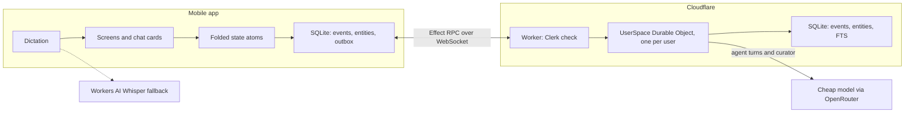
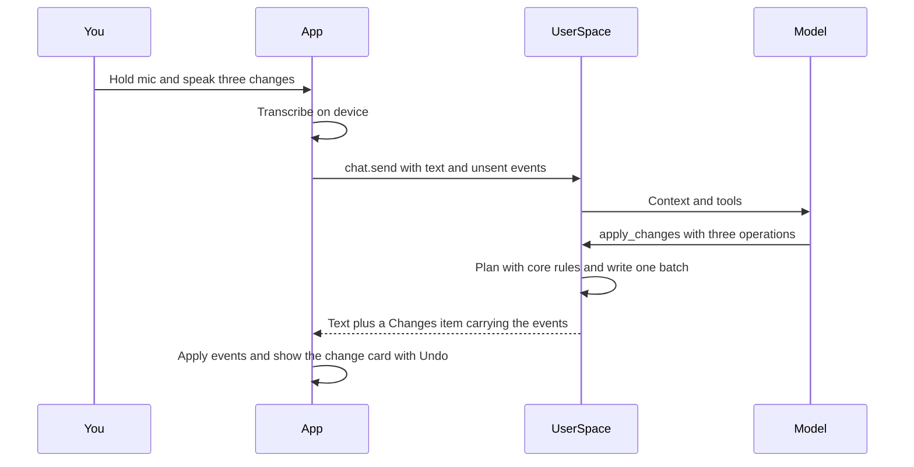

# Architecture

Package boundaries and the phone ↔ Worker ↔ Durable Object shape for M2–M4.

## Runtime diagram

## Detached agent turn

## Package boundaries

| Package / app | Owns | May import |
| --- | --- | --- |
| `packages/core` (`@yatma/core`) | Schemas, events, fold, clock, rules, order keys, undo, `buildContext`, refs, RPC group, tool definitions | **Only** `effect` (and its own modules) |
| `apps/mobile` | Expo UI, local SQLite, atoms, outbox, Clerk client, RPC client | `@yatma/core`, Expo / RN client libs — **never** Worker-only packages |
| `apps/worker` | Worker entry, Clerk verify, `UserSpace` DO, FTS, agent runtime, curator alarms | `@yatma/core`, `@clerk/backend`, `@effect/sql-sqlite-do`, `alchemy`, OpenRouter / Workers AI |

Rules:

- Server-only packages stay in the worker. Importing `@clerk/backend`, `@effect/sql-sqlite-do`, or `alchemy` from the Expo app is a bug.
- Classes only where Effect / alchemy require them (service tags, tagged errors, Worker, Durable Object). Everything else is functional.
- Phone and DO keep the same logical tables: append-only `events` plus folded `entities`, written in one transaction per applied batch.

## Where milestones land

| Milestone | Surface |
| --- | --- |
| M2 Sync | `sync.push` / `sync.subscribe`, DO store, clock, outbox, sign-out wipe, `account.delete` — see [sync.md](./sync.md) |
| M3 Agent | Detached turns, five tools, `buildContext`, change cards / undo, usage cap — see [agent.md](./agent.md) |
| M4 Handbook | Pages/briefs, Context tab, curator wrap-up + idle alarm — see [agent.md](./agent.md#curator-m4) |
